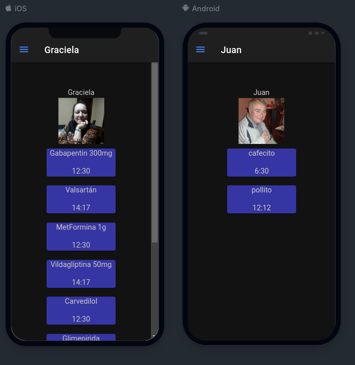

<style>

/* By default, make all images center-aligned, and 60% of the width
of the screen in size */
img
{
    display:block;
    float:none;
    margin-left:auto;
    margin-right:auto;
    width:300px;
}

/* Create a CSS class to style images to left-align, or "float left" */
.leftAlign
{
    display:inline-block;
    float:left;
    /* provide a 15 pixel gap between the image and the text to its right */
    margin-right:15px;
}

/* Create a CSS class to style images to right-align, or "float right" */
.rightAlign
{
    display:inline-block;
    float:right;
    /* provide a 15 pixel gap between the image and the text to its left */
    margin-left:15px;
}

</style>

# TaskReminder

Simple ionic app that shows scheduled dosis of medicine for 2 patients.

## Resourses used

* Icon & Splash image: png by me.

## build

Install dependencies:

```bash
npm install
```

In order to generate, copy the images inside /resourses and run (it will use only the icon.png image for both splash and icon):

```bash
npx capacitor-assets generate
```

Generate the app:

```bash
npm run build
```

Add capacitor android plugin, build android and run in android Studio:

```bash
ionic cap add android
ionic cap build android
ionic cap run android
```

## Captures

### Main Page


### Menu


### One client


